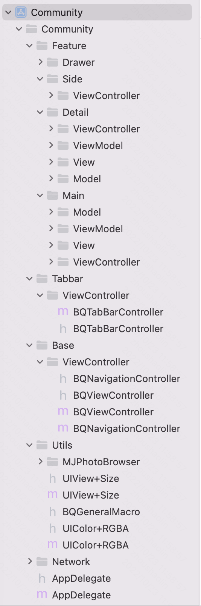

## 1. 项目描述 Project Description
Community项目
## 2. 安装 Installation
### 1.1 安装环境配置 Environment configuration
Xcode 13.4.1, iOS 14.0+
### 1.2 安装过程 Installation
pod install
### 1.3 构建/打包&程序运行命令 building & starting commands
pod install & xcodebuild
## 3. 项目文件结构 Project directory structure

## 4. 附录 Appendix
### 4.1 统一缩写备注表 Abbreviation Form
| 全称 Full name| 缩写 Abbreviation| 备注 Notes|
|:----:|:----:|:----:|
| BQ | Banqu |  |

### 4.2 开发工具 Development tools
| 名称 Name| 类型 Type| 备注 Notes|
|:----:|:----:|:----:|
| Xcode | IDE | 版本 13.4 以上 |
| Cocoapods | 三方包管理工具 | 版本 1.11.2 |

### 4.3 第三方包 3rd-party dependencies
| 名称 Name| 用途 Functionality| 链接 Links| 备注 Notes|
|:----:|:----:|:----:|:----:|
| AFNetworking | 网络 |  |  |
| Masonry  | 布局 |  |  |
| YYModel  | 对象解析 |  |  |
| Toast  | 弹层 |  |  |
| SDWebImage  | 网络图片库 |  |  |
| MJPhotoBrowser  | 图片浏览 |  |  |

## 5. 架构 Structure

### 6. GUI

